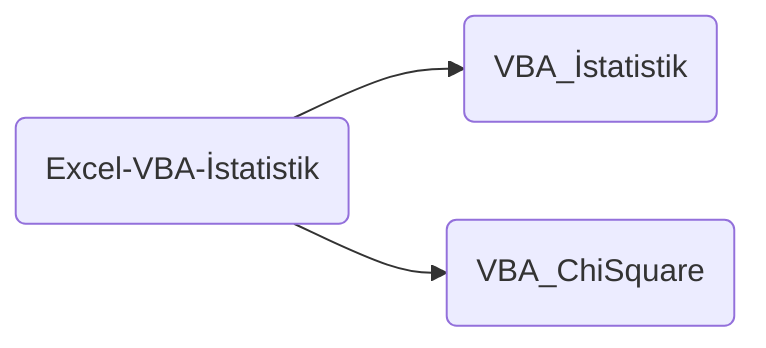

# Excel-VBA-Istatistik (Eng)

Hi,

In this repository, I will be showing my VBA macro samples. Right now, only two different working subdirectories as **statistics** (only in English and will have Turkish explanation, too) and **chi-square** (which has nothing at all except codes).

# Excel-VBA-Istatistik (Tur)

Merhaba,

Bu depoda, VBA makro örneklerimi göstereceğim. Şu anda, **istatistik** (yalnızca İngilizce ve Türkçe açıklaması da olacak) ve **ki-kare** (kodlar dışında hiçbir şeyi olmayan) olmak üzere yalnızca iki farklı çalışan alt dizin var.

