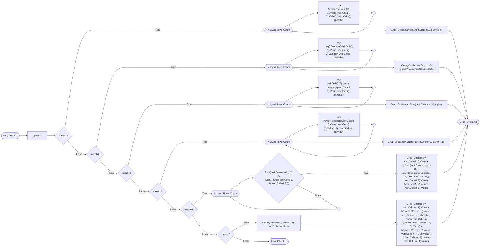

# Excel'de Gruplandırılmış Frekans Serileri İçin Bazı İstatistik Hesaplama Örnekleri

Excel, aritmetik ortalamadan Gamma olasılık fonksiyonuna kadar değişen istatistiksel olan fonlsyionlar da dahil olmak üzere geniş bir fonksiyon kütüphanesine sahiptir. Ancak sorunlardan biri, bu fonksiyonların çoğunun verileri basit seriler olarak kabul etmesidir. Bazen istatistikçiler bile frekans ya da gruplandırılmış frekans serileri/tabloları/dağılımları gibi diğer serilerle çalışmak zorunda kalabilirler. Excel'in kütüphanesinde **TOPLA.ÇARPIM** (SUMPRODUCT) gibi hesaplamaları yapmanıza yardımcı olabilecek bazı fonksiyonlar da vardır, ancak yine de Excel'e nasıl yapılacağını söylemenizi gerektiriyor! Bu yüzden, burada Excel'de daha kolay hesaplama yapmak için bazı basit kod örneklerim var.

## Histogram ve Verilerin Gruplandırılması için Grup Sayısını veya Genişliğini Seçmek İçin Bazı Kurallar

_Histogram_ veya _veri gruplandırma_ için **grup** ***sayısı*** ($k$) veya ***genişliği*** ($h$) seçiminde **en iyi** seçim yoktur, ancak seçim için kullanılabilecek bazı _önerilen kurallar_ vardır. Bu küçük fonksiyon, belirli bir basit seri için grup sayısı veya genişliği hesaplamaktadır.

### Karekök Kuralı

&nbsp;&nbsp;&nbsp;&nbsp; $k=\lceil\text{ } \sqrt{n}\text{ } \rceil$

### Sturges Kuralı

&nbsp;&nbsp;&nbsp;&nbsp; $k=1+\lceil log_2 n \rceil$

### Rice Kuralı

&nbsp;&nbsp;&nbsp;&nbsp; $k=\lceil\text{ } 2 \sqrt[3]{n} \text{ } \rceil$

### Doane's Rule

&nbsp;&nbsp;&nbsp;&nbsp; $k=1+\lceil log_2 n +log_2(1+\frac{\left | g_1 \right |}{\sigma_{g_1}})\rceil$; burada $g_1$, dağılımın dağılımın çarpıklığının bir tahmini iken

&nbsp;&nbsp;&nbsp;&nbsp; $\sigma_{g_1}=\sqrt{\frac{6(n-1)}{(n+1)(n+3)}}$

### Scott's Rule

&nbsp;&nbsp;&nbsp;&nbsp; $h=\frac{3.49 \hat{\sigma}}{\sqrt[3]{n}}$; burada $\hat{\sigma}$ örneklem standart sapmasını ifade eder.

### Freedman-Diaconis's (FD) Rule

&nbsp;&nbsp;&nbsp;&nbsp; $h=2\frac{KAF(x)}{\sqrt[3]{n}}$; burada KAF, kartiller arası farkı ifade eder.

```vba
'While below declaration was made in general declaration section of the module in use
'Kullanılan modülün genel bildirimler bölümünde aşağıdaki bildirim yapılmış iken
Enum etiketler
        Karekok = 1
        Sturges = 2
        Rice = 3
        Doane = 4
        Scott = 5
        FD = 6
End Enum

Function grupla(veri As Range, Optional metot As etiketler = Sturges, Optional yuvarla As Boolean = False)
    Dim n As Integer, k as Integer, h As Single
    If veri.Columns.Count = 1 Then
        n = veri.Rows.Count
    ElseIf veri.Rows.Count = 1 Then
        n = veri.Columns.Count
    Else
        MsgBox "Veriniz satır veya sütun şeklinde olmalı!" '/"Your data must be in rows or columns!"
    End If
    With WorksheetFunction
        Select Case metot
            Case Karekok
                'Grup sayısı döndürür/Returns number of bins
                k = WorksheetFunction.Ceiling(Sqr(n), 1)
                grupla = k
            Case Sturges
                'Grup sayısı döndürür/Returns number of bins
                k = .Ceiling(.Log(n, 2), 1) + 1
                grupla = k
            Case Rice
                'Grup sayısı döndürür/Returns number of bins
                k = .Ceiling(2 * .Power(n, 1 / 3), 1)
                grupla = k
            Case Doane
                'Grup sayısı döndürür/Returns number of bins
                sd = Sqr((6 * (n - 2)) / ((n + 1) * (n + 3)))
                k = 1 + .Ceiling(.Log(n, 2) + .Log(1 + Abs(.Skew(veri)) / sd, 2), 1)
                grupla = k
            Case Scott
                'Grup aralığı döndürür/Returns width of bins
                h = 3.5 * .StDev_S(veri) / .Power(n, 1 / 3)
                grupla = h
            Case FD
                'Grup aralığı döndürür/Returns width of bins
                h = 2 * (.Quartile_Exc(veri, 3) - .Quartile_Exc(veri, 1)) / .Power(n, 1 / 3)
                grupla = h
        End Select
        If yuvarla Then
            grupla = .Round(grupla, 2)
        Else
            grupla = grupla
            End If
    End With
End Function
```

## Bazı Merkezi Eğilim Ölçüleri

Bu küçük fonksiyon kodu, Excel elektronik tablosuna, aşağıdaki gibi girilen ___grupladırılnmış frekans dağılımı___ için **aritmetik ortalama** (metot=1, varsayılan), **geometrik ortalama** (2), **harmonik ortalama** (3), **kareli ortalama** (4), **medyan** (5) ve **mod** (6) hesaplayabilir. Tabii ki tüm olası durumlar kontrol edilmelidir, bu işlev, henüz tüm durumları kontrol etmemektedir.

  
 
 ***Şekil 1:*** *Gruplandırılmış Seri için hesaplama örneği*

Gruplandırılmış veriler için hesaplama algoritmasının akış şeması:




``` vba
Function Grup_Ortalama(veri As Range, Optional metot As Integer = 1) As Single
    'Metot=1 Aritmetik Ortalama ve varsayılan (Arithmetic Mean and set as default)
    'Metot=2 Geometrik Ortalama (Geometric Mean)
    'Metot=3 Harmonik Ortalama (Harmonic Mean)
    'Metot=4 Kareli Ortalama (Root Mean Square)
    'Metot=5 Medyan (Median)
    'Metot=6 Mod (Mode)
    Dim i As Integer, m As Integer
    Dim toplam As Single
    
    toplam = 0
    With WorksheetFunction
        If metot = 1 Then
            For i = 1 To veri.Rows.Count
                toplam = toplam + .Average(veri.Cells(i, 1).Value, veri.Cells(i, 2).Value) * veri.Cells(i, 3).Value
            Next i
            Grup_Ortalama = toplam / .Sum(veri.Columns(3))
        ElseIf metot = 2 Then
            For i = 1 To veri.Rows.Count
                toplam = toplam + .Log(.Average(veri.Cells(i, 1).Value, veri.Cells(i, 2).Value)) * veri.Cells(i, 3).Value
            Next i
            Grup_Ortalama = .Power(10, (toplam / .Sum(veri.Columns(3))))
        ElseIf metot = 3 Then
            For i = 1 To veri.Rows.Count
                toplam = toplam + veri.Cells(i, 3).Value / (.Average(veri.Cells(i, 1).Value, veri.Cells(i, 2).Value))
            Next i
            Grup_Ortalama = .Sum(veri.Columns(3)) / toplam
        ElseIf metot = 4 Then
            For i = 1 To veri.Rows.Count
                toplam = toplam + .Power(.Average(veri.Cells(i, 1).Value, veri.Cells(i, 2).Value), 2) * veri.Cells(i, 3).Value
            Next i
            Grup_Ortalama = Sqr(toplam / .Sum(veri.Columns(3)))
        ElseIf metot = 5 Then
            For i = 1 To veri.Rows.Count
                If .Sum(veri.Columns(3)) / 2 <= .Sum(Range(veri.Cells(1, 3), veri.Cells(i, 3))) Then Exit For
            Next i
            Grup_Ortalama = veri.Cells(i, 1).Value + (((.Sum(veri.Columns(3)) / 2) - .Sum(Range(veri.Cells(1, 3), veri.Cells(i - 1, 3)))) / veri.Cells(i, 3).Value) * (veri.Cells(i, 2).Value - veri.Cells(i, 1).Value)
        ElseIf metot = 6 Then
            m = .Match(.Max(veri.Columns(3)), veri.Columns(3), 0)
            Grup_Ortalama = veri.Cells(m, 1).Value + Abs(veri.Cells(m, 3).Value - veri.Cells(m - 1, 3).Value) / (Abs(veri.Cells(m, 3).Value - veri.Cells(m - 1, 3).Value) + Abs(veri.Cells(m, 3).Value - veri.Cells(m + 1, 3).Value)) * (veri.Cells(m, 2).Value - veri.Cells(m, 1).Value)
        End If
    End With
End Function
```
