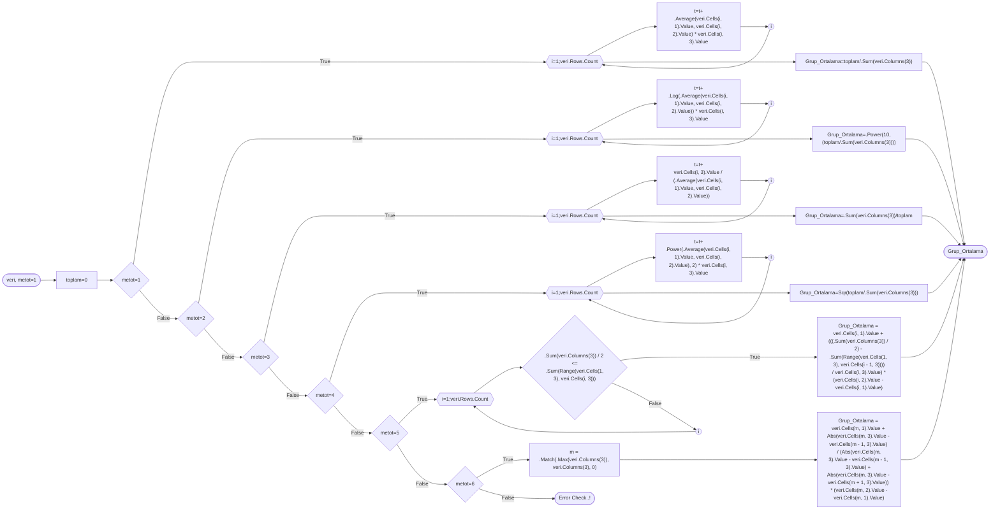
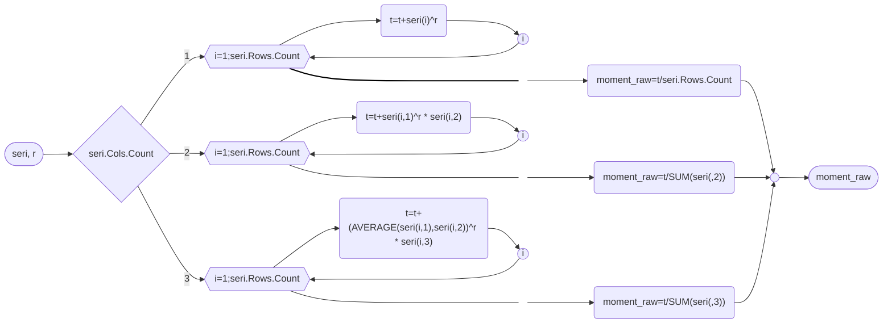

# Some Statistical Calculation Examples For Grouped Frequency Series in Excel


Excel has a large function library, including statistical ones varying from arithmetic mean to Gamma probability function. But, one of the problems is that most of these functions accepts data as simple series. And, sometimes, even statisticians may have to work with other series like frequency or grouped frequency series/tables/distributions. Excel also has some functions in its library that can help to do the math like **SUMPRODUCT** but again, you have to tell Excel how to do! So, here, I have some simple code samples to calculate more easily in Excel. 

## Some Rules to Select Number or Width of Bins for Histogram and Grouping Data

There is no **best** choice of ***number*** ($k$) or ***width*** ($h$) of **bins** for _histogram_ or _grouping data_, but there are some _suggested rules_ that can be used for choosing. This small function is calculating number or width of bins for a given simple series.

### Square-root Rule
&nbsp;&nbsp;&nbsp;&nbsp; $k=\lceil\text{ } \sqrt{n}\text{ } \rceil$

### Sturges' Rule

&nbsp;&nbsp;&nbsp;&nbsp; $k=1+\lceil log_2 n \rceil$

### Rice Rule

&nbsp;&nbsp;&nbsp;&nbsp; $k=\lceil\text{ } 2 \sqrt[3]{n} \text{ } \rceil$

### Doane's Rule

&nbsp;&nbsp;&nbsp;&nbsp; $k=1+\lceil log_2 n +log_2(1+\frac{\left | g_1 \right |}{\sigma_{g_1}})\rceil$; where $g_1$ is the estimate of skewness of the distribution and

&nbsp;&nbsp;&nbsp;&nbsp; $\sigma_{g_1}=\sqrt{\frac{6(n-1)}{(n+1)(n+3)}}$

### Scott's Rule

&nbsp;&nbsp;&nbsp;&nbsp; $h=\frac{3.49 \hat{\sigma}}{\sqrt[3]{n}}$; where $\hat{\sigma}$ is the sample standart deviation.

### Freedman-Diaconis's (FD) Rule

&nbsp;&nbsp;&nbsp;&nbsp; $h=2\frac{IQR(x)}{\sqrt[3]{n}}$

```vba
'While below declaration was made in general declaration section of the module in use
'Kullanılan modülün genel bildirimler bölümünde aşağıdaki bildirim yapılmış iken
Enum etiketler
        Karekok = 1
        Sturges = 2
        Rice = 3
        Doane = 4
        Scott = 5
        FD = 6
End Enum

Function grupla(veri As Range, Optional metot As etiketler = Sturges, Optional yuvarla As Boolean = False)
    Dim n As Integer, k as Integer, h As Single
    If veri.Columns.Count = 1 Then
        n = veri.Rows.Count
    ElseIf veri.Rows.Count = 1 Then
        n = veri.Columns.Count
    Else
        MsgBox "Veriniz satır veya sütun şeklinde olmalı!" '/"Your data must be in rows or columns!"
    End If
    With WorksheetFunction
        Select Case metot
            Case Karekok
                'Grup sayısı döndürür/Returns number of bins
                k = WorksheetFunction.Ceiling(Sqr(n), 1)
                grupla = k
            Case Sturges
                'Grup sayısı döndürür/Returns number of bins
                k = .Ceiling(.Log(n, 2), 1) + 1
                grupla = k
            Case Rice
                'Grup sayısı döndürür/Returns number of bins
                k = .Ceiling(2 * .Power(n, 1 / 3), 1)
                grupla = k
            Case Doane
                'Grup sayısı döndürür/Returns number of bins
                sd = Sqr((6 * (n - 2)) / ((n + 1) * (n + 3)))
                k = 1 + .Ceiling(.Log(n, 2) + .Log(1 + Abs(.Skew(veri)) / sd, 2), 1)
                grupla = k
            Case Scott
                'Grup aralığı döndürür/Returns width of bins
                h = 3.5 * .StDev_S(veri) / .Power(n, 1 / 3)
                grupla = h
            Case FD
                'Grup aralığı döndürür/Returns width of bins
                h = 2 * (.Quartile_Exc(veri, 3) - .Quartile_Exc(veri, 1)) / .Power(n, 1 / 3)
                grupla = h
        End Select
        If yuvarla Then
            grupla = .Round(grupla, 2)
        Else
            grupla = grupla
            End If
    End With
End Function
```
## Preperation to Histogram Plot
In this section, I have two VBA code blocks for preperation to histogram plot and ploting of it. The first one, _function routine_ ***dikdortgen*** which means rectangular and written as "dikdörtgen", prepares the drawing points of the rectangulars representing the data groups in the plot, and the second one, _sub routine_ ***histo*** -but, for now, it is in _CommandButton event routine_-, will plot the histogram with the help of ***dikdortgen***.

### Form Design for the Macro


***Figure 1:*** *Form design for the macro*

Designed using 3 refedits, 5 labels, 1 combobox, 1 textbox, 1 checkbox and 1 button objects.

```vba
'=============================================================================================
'Grouping Method Controlling for Special Values
'=============================================================================================
Private Sub ComboBox1_Change()
    If ComboBox1.ListIndex = 6 Then
        TextBox1.Visible = True
        Label4.Visible = True
    Else
        TextBox1.Visible = False
        TextBox1.Text = Empty
        Label4.Visible = False
    End If
End Sub
'=============================================================================================
'Grouping Data and Histogram Plot with Frequency Plot
'=============================================================================================
Private Sub CommandButton1_Click()
    Dim veri As Range, c As Double, h As Double, si As Double
    Dim i As Integer, j As Integer
    
    Set veri = Range(RefEdit1.Text)
    Set cikti = Range(RefEdit2.Text)
        
    Select Case ComboBox1.ListIndex
        With WorksheetFunction
            Case 0
                h = (.Max(veri) - .Min(veri))/grupla(veri, metot=1, yuvarla As Boolean = true)
            Case 1
                h = (.Max(veri) - .Min(veri))/grupla(veri, metot=2, yuvarla As Boolean = true)
            Case 2
                h = (.Max(veri) - .Min(veri))/grupla(veri, metot=3, yuvarla As Boolean = true)
            Case 3
                h = (.Max(veri) - .Min(veri))/grupla(veri, metot=4, yuvarla As Boolean = true)
            Case 4
                h = grupla(veri, metot=5, yuvarla As Boolean = true)
            Case 5
                h = grupla(veri, metot=6, yuvarla As Boolean = true)
            Case 6         
                h = (.Max(veri) - .Min(veri)) / TextBox1.Text
        End With
    End Select
        
    With WorksheetFunction
        c = .Min(veri)
        i = 0
        Do
            cikti.Offset(i, 0).Value = c
            cikti.Offset(i, 1).Value = c + h
            f = 0
            For j = 1 To veri.Rows.Count
                If veri(j, 1).Value >= c And veri(j, 1).Value < c + h Then
                    f = f + 1
                End If
            Next j
            cikti.Offset(i, 2).Value = f
            If CheckBox1.Value = True Then cikti.Offset(i, 3).Value = .Average(c, c + h)
            c = c + h
            i = i + 1
        Loop While c <= .Max(veri)
    End With
    
    If CheckBox1.Value = False Then
        Set grup = Range(cikti.Address & ":" & cikti.Offset(i - 1, 2).Address)
    ElseIf CheckBox1.Value = True Then
        Set grup = Range(cikti.Address & ":" & cikti.Offset(i - 1, 3).Address)
    End If
'=============================================================================================
'Plotting Histogram
'=============================================================================================
    ActiveSheet.ChartObjects.Add Left:=cikti.Offset(0, 4).Left, Top:=cikti.Offset(0, 4).Top, Width:=500, Height:=500
    ActiveSheet.ChartObjects(ActiveSheet.ChartObjects.Count).Activate
    With ActiveChart
        .ChartType = xlXYScatterLines
        .HasTitle = True
        If CheckBox1.Value = False Then
            .ChartTitle.Text = "Histogram" & vbLf & ComboBox1.List(ComboBox1.ListIndex)
        ElseIf CheckBox1.Value = True Then
            .ChartTitle.Text = "Histogram ve Frekans Poligonu" & vbLf & ComboBox1.List(ComboBox1.ListIndex)
        End If
        .Axes(xlCategory).HasTitle = True
        If RefEdit3.Text = Empty Then
            .Axes(xlCategory).AxisTitle.Text = "X"
        Else
            .Axes(xlCategory).AxisTitle.Text = Range(RefEdit3.Text).Cells.Value
        End If
        .Axes(xlValue).HasTitle = True
        .Axes(xlValue).AxisTitle.Text = "Frekans"
        .Axes(xlCategory).MajorUnit = h
        .Axes(xlCategory).MinimumScale = WorksheetFunction.Min(veri) - h
        .Axes(xlCategory).CrossesAt = WorksheetFunction.Min(veri) - h
        .Axes(xlCategory, xlPrimary).TickLabels.NumberFormat = "#0,#0"
        .Axes(xlCategory).TickLabels.Orientation = 45
        For i = 1 To grup.Rows.Count
            y = dikdortgen(Range(grup.Cells(i, 1), grup.Cells(i, 2)), grup.Cells(i, 3), "y")
            x = dikdortgen(Range(grup.Cells(i, 1), grup.Cells(i, 2)), grup.Cells(i, 3), "x")
            .SeriesCollection.NewSeries
            .SeriesCollection(.SeriesCollection.Count).Values = y
            .SeriesCollection(.SeriesCollection.Count).XValues = x
            .SeriesCollection(.SeriesCollection.Count).Border.Color = RGB(0, 0, 255)
            .SeriesCollection(.SeriesCollection.Count).Format.Line.Weight = 1.5
            .SeriesCollection(.SeriesCollection.Count).MarkerStyle = xlMarkerStyleNone
            If i = 1 And RefEdit3.Text = Empty Then
                .SeriesCollection(.SeriesCollection.Count).Name = "X"
            Else
                .SeriesCollection(.SeriesCollection.Count).Name = Range(RefEdit3.Text).Cells.Value
            End If
        Next i
        Debug.Print "Entry Count=" & .Legend.LegendEntries.Count
        i = .Legend.LegendEntries.Count
        Do While i > 1
            .Legend.LegendEntries(i).Delete
            i = i - 1
        Loop
        If CheckBox1.Value = True Then
            .SeriesCollection.NewSeries
            .SeriesCollection(.SeriesCollection.Count).Values = grup.Columns(3)
            .SeriesCollection(.SeriesCollection.Count).XValues = grup.Columns(4)
            .SeriesCollection(.SeriesCollection.Count).Border.Color = RGB(255, 0, 0)
            .SeriesCollection(.SeriesCollection.Count).Format.Line.Weight = 1.5
            .SeriesCollection(.SeriesCollection.Count).MarkerStyle = xlMarkerStyleNone
            .SeriesCollection(.SeriesCollection.Count).Name = "Frek. Poligonu"
        End If        
    End With
    Unload Me
End Sub
'=============================================================================================
'Form Initialization Event
'=============================================================================================
Private Sub UserForm_Initialize()
    With ComboBox1
        .AddItem "Karekök"
        .AddItem "Sturges"
        .AddItem "Rice"
        .AddItem "Doane"
        .AddItem "Scott"
        .AddItem "Freedman-Diaconis"
        .AddItem "Özel"
        .ListIndex = 0
    End With
    TextBox1.Visible = False
    TextBox1.Text = Empty
    Label4.Visible = False
    RefEdit3.SetFocus
    UserForm1.Caption = "Histogram ve Frekans Poligonu Grafikleri"
End Sub
'=============================================================================================
'Prepreparation Function for Histogram Plot
'=============================================================================================
Private Function dikdortgen(aralik As Range, f As Single, Optional hangisi = "x")
    dortgenx = Array(aralik.Cells(1, 1), aralik.Cells(1, 1), aralik.Cells(1, 2), aralik.Cells(1, 2), aralik.Cells(1, 1))
    dortgeny = Array(0, f, f, 0, 0)
    Select Case hangisi
        Case "x"
            dikdortgen = dortgenx
        Case "y"
            dikdortgen = dortgeny
        End Select
End Function
```
### Example Data


***Figure 2:*** *An example with Excel generated Random 1 ~ N(0, 1)*

You can also download sample data with this link: 

## Some Central Tendency Measures

This small function code can calculate **arithmetic mean** (metot=1 ,default) , **geometric mean** (2), **harmonic mean** (3), **root mean square** (4), **median** (5) and **mode** (6) for ___grouped frequency distribution___ entered as below in Excel spreadsheet. Of course all possible situations must be checked, this function do not have yet.


***Figure 2:*** *Calculation example for grouped frequency distribution*

Flowchart of the calculation algorithym for grouped data:




``` vba
Function Grup_Ortalama(veri As Range, Optional metot As Integer = 1) As Single
    'Metot=1 Aritmetik Ortalama ve varsayılan (Arithmetic Mean and set as default)
    'Metot=2 Geometrik Ortalama (Geometric Mean)
    'Metot=3 Harmonik Ortalama (Harmonic Mean)
    'Metot=4 Kareli Ortalama (Root Mean Square)
    'Metot=5 Medyan (Median)
    'Metot=6 Mod (Mode)
    Dim i As Integer, m As Integer
    Dim toplam As Single
    
    toplam = 0
    With WorksheetFunction
        If metot = 1 Then
            For i = 1 To veri.Rows.Count
                toplam = toplam + .Average(veri.Cells(i, 1).Value, veri.Cells(i, 2).Value) * veri.Cells(i, 3).Value
            Next i
            Grup_Ortalama = toplam / .Sum(veri.Columns(3))
        ElseIf metot = 2 Then
            For i = 1 To veri.Rows.Count
                toplam = toplam + .Log(.Average(veri.Cells(i, 1).Value, veri.Cells(i, 2).Value)) * veri.Cells(i, 3).Value
            Next i
            Grup_Ortalama = .Power(10, (toplam / .Sum(veri.Columns(3))))
        ElseIf metot = 3 Then
            For i = 1 To veri.Rows.Count
                toplam = toplam + veri.Cells(i, 3).Value / (.Average(veri.Cells(i, 1).Value, veri.Cells(i, 2).Value))
            Next i
            Grup_Ortalama = .Sum(veri.Columns(3)) / toplam
        ElseIf metot = 4 Then
            For i = 1 To veri.Rows.Count
                toplam = toplam + .Power(.Average(veri.Cells(i, 1).Value, veri.Cells(i, 2).Value), 2) * veri.Cells(i, 3).Value
            Next i
            Grup_Ortalama = Sqr(toplam / .Sum(veri.Columns(3)))
        ElseIf metot = 5 Then
            For i = 1 To veri.Rows.Count
                If .Sum(veri.Columns(3)) / 2 <= .Sum(Range(veri.Cells(1, 3), veri.Cells(i, 3))) Then Exit For
            Next i
            Grup_Ortalama = veri.Cells(i, 1).Value + (((.Sum(veri.Columns(3)) / 2) - .Sum(Range(veri.Cells(1, 3), veri.Cells(i - 1, 3)))) / veri.Cells(i, 3).Value) * (veri.Cells(i, 2).Value - veri.Cells(i, 1).Value)
        ElseIf metot = 6 Then
            m = .Match(.Max(veri.Columns(3)), veri.Columns(3), 0)
            Grup_Ortalama = veri.Cells(m, 1).Value + Abs(veri.Cells(m, 3).Value - veri.Cells(m - 1, 3).Value) / (Abs(veri.Cells(m, 3).Value - veri.Cells(m - 1, 3).Value) + Abs(veri.Cells(m, 3).Value - veri.Cells(m + 1, 3).Value)) * (veri.Cells(m, 2).Value - veri.Cells(m, 1).Value)
        End If
    End With
End Function
```

## Raw Moments of a Distribution

If series' column count is 1 then it is assumed as simple series, if it is 2 then is assumed as frequency ditribution series, and if it is 3 then is assumed as grouped frequency distribution series and otherwise en error message will be shown.

Flowchart of calculation algorithym for simple series:




``` vba
Function moment_raw(seri As Range, Optional r As Integer = 1)
    Dim t As Single
    t = 0
    Select Case seri.Columns.Count
        Case 1
            For Each i In seri
                t = t + i.Value ^ r
            Next i
           moment_raw = t / seri.Rows.Count
        Case 2
            For Each i In seri.Rows
                t = t + (i.Columns(1).Value ^ r) * i.Columns(2).Value
            Next i
            moment_raw = t / WorksheetFunction.Sum(seri.Columns(2))
        Case 3
            For Each i In seri.Rows
                t = t + WorksheetFunction.Average(i.Columns(1).Value, i.Columns(2).Value) ^ r * i.Columns(3).Value
            Next i
            moment_raw = t / WorksheetFunction.Sum(seri.Columns(3))
        Case Else
           moment_raw = "#N/A!"
    End Select
End Function
```

## Central Moments of a Distribution

This code is consist of conversition formulas from raw moments, but it will have classic formula calculations, too.  </br> 

``` vba
Function moment_cent(moments As Range, Optional convert As Boolean = True, Optional r As Integer = 1, Optional mean As Single = 0)
    Dim t As Single
    t = 0
    With moments
        Debug.Print "Row Count: " & .Rows.Count
        Select Case convert
            Case True
                For j = 0 To .Rows.Count - 1
                    t = t + WorksheetFunction.Combin(.Rows.Count - 1, j) * (-1) ^ (.Rows.Count - 1 - j) * .Rows(j + 1) * .Rows(2) ^ (.Rows.Count - 1 - j)
                    Debug.Print "j= " & .Rows(j + 1) & " " & t
                Next j
                moment_cent = t
            Case False
                Select Case .Columns.Count
                    Case 1
                        For Each i In moments
                            t = t + (i.Value - mean) ^ r
                        Next i
                        moment_cent = t / .Rows.Count
                    Case 2
                        For Each i In moments
                            t = t + (i.Columns(1).Value - mean) ^ r * i.Columns(2).Value
                        Next i
                        moment_cent = t / WorksheetFunction.Sum(.Columns(2))
                    Case 3
                        For Each i In seri.Rows
                              t = t + (WorksheetFunction.Average(i.Columns(1).Value, i.Columns(2).Value)-mean) ^ r * i.Columns(3).Value
                        Next i
                        moment_raw = t / WorksheetFunction.Sum(seri.Columns(3))
                    Case Else
                        moment_cent = "#N/A!"
                End Select
            Case Else
                moment_cent = "#N/A!"
        End Select
    End With
End Function
```
